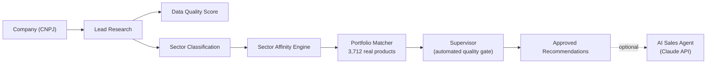

# AI Commercial Intelligence

**🇧🇷 [Leia em Português](README.pt-BR.md)**

> Turning a spreadsheet of 15,000 companies into a system that tells a sales team exactly who to call, what to offer, and why.

## The problem

SESI and SENAI (Brazil's national industry training and worker-wellness systems) sell hundreds of real courses and services — safety training, quality management, industrial maintenance, and more — to thousands of companies. But matching the *right* company to the *right* product, out of a catalog of **3,712 real offerings**, was a manual, gut-feeling process. A sales coordinator had no fast way to answer: *"Out of my 15,000 companies, which ones actually need what we sell, and which specific product should I lead with?"*

## What this project does

Give it a company (by tax ID / CNPJ), and it:

1. **Looks up the company** in a real database of ~15,000 industrial businesses
2. **Scores data quality and sales priority** — is this lead worth pursuing, and how urgently?
3. **Classifies its industry sector** from its official activity code
4. **Matches it against the real product catalog** (not a generic category — an actual course, with a real product code)
5. **Runs every match through an automated quality check** before it ever reaches a human — rejecting weak or coincidental matches
6. **Optionally, generates a ready-to-use sales approach** (a pain hypothesis, qualifying questions, talking points, and a next step) using Claude, Anthropic's AI model

Everything is presented in a dashboard a non-technical commercial team can use directly — search a company, see the market overview, get a recommendation, and understand *why* it was recommended.



## Why this is harder than "call an API"

The interesting engineering problem here wasn't wiring up a database — it was making the *matching* trustworthy. Along the way, real data testing surfaced real failure modes that a demo built on 2-3 examples would never catch:

- A product matched purely because it shared one generic word with the target sector (e.g. "technical" matched "Sales Techniques" to a "Technical Training" category) — fixed by weighting how *rare* a matching term is across the whole catalog, not just whether it matched.
- A product matched on a technically rare word that still wasn't sector-relevant (a bakery/food course matched a metalworking company) — this is now a known, documented limit, not a hidden bug: the system flags *why* a match happened so a human can catch it, rather than pretending the match is certain.
- Only after every deterministic layer (classification → affinity → matching → quality gate) was tested against dozens of real companies did the project add its first AI-generated content — and even then, the AI is instructed never to invent a product or number that wasn't already verified upstream.

That "evidence, then trust" order is deliberate: the AI writes the sales pitch, but it never chooses what to sell — that decision is fully auditable, rule-based, and tested.

## What's inside

| Layer | What it does |
|---|---|
| **Lead Research** | Looks up a company and normalizes its data |
| **Data Quality Agent** | Flags whether there's enough reliable data to act on |
| **Sector Classifier** | Turns an official activity code into a business sector |
| **Sector Affinity Engine** | Ranks which SESI/SENAI service areas fit that sector |
| **Portfolio Matcher** | Finds actual catalog products/courses that match, with evidence |
| **Supervisor** | Automated quality gate — approves or rejects each match with a documented reason |
| **Opportunity Engine** | Routes cross-sell vs. new-customer logic based on existing relationship |
| **SDR (LLM) Agent** | Generates a human-readable sales approach from Claude, grounded only in already-approved data |
| **Streamlit App** | The interface a commercial team actually uses — market dashboard + per-company recommendation |

**Tech stack:** Python, pandas, Pydantic, pytest, Streamlit, Anthropic Claude API

**Test coverage:** 40 automated tests, including a dedicated *evaluation suite* of real edge cases discovered during development — a permanent regression check so a future change can't silently reintroduce a bug that was already fixed once.

## Running it locally

```bash
pip install -r requirements.txt
streamlit run app.py
```

The AI sales-approach feature requires an `ANTHROPIC_API_KEY` environment variable; everything else (search, scoring, matching, dashboard) works without it.

---

*Built iteratively as a working pilot, with every design decision — thresholds, quality checks, what the AI is and isn't allowed to do — driven by testing against real data rather than assumptions.*
