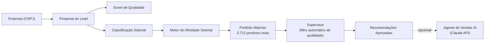

# AI Commercial Intelligence

**🇺🇸 [Read in English](README.md)**

> Transformar uma planilha de 15 mil empresas num sistema que diz a um time comercial exatamente quem ligar, o que oferecer, e por quê.

## O problema

O SESI e o SENAI vendem centenas de cursos e serviços reais — treinamento de segurança, gestão da qualidade, manutenção industrial, entre outros — para milhares de empresas. Mas cruzar a empresa *certa* com o produto *certo*, dentro de um catálogo de **3.712 produtos reais**, era um processo manual, feito no feeling. Um coordenador comercial não tinha como responder rápido: *"Das minhas 15 mil empresas, quais realmente precisam do que a gente vende, e qual produto específico eu ofereço primeiro?"*

## O que este projeto faz

Você dá uma empresa (pelo CNPJ), e o sistema:

1. **Busca a empresa** numa base real de ~15 mil indústrias
2. **Avalia qualidade dos dados e prioridade comercial** — vale a pena investir tempo nesse lead, e com que urgência?
3. **Classifica o setor econômico** a partir do código oficial de atividade (CNAE)
4. **Cruza com o catálogo real de produtos** (não uma categoria genérica — um curso de verdade, com código real)
5. **Passa cada recomendação por uma checagem automática de qualidade** antes de chegar em qualquer pessoa — rejeitando combinações fracas ou coincidentes
6. **Opcionalmente, gera uma abordagem comercial pronta pra usar** (hipótese de dor, perguntas de qualificação, argumentação e próxima ação) usando a Claude, IA da Anthropic

Tudo isso aparece num painel que qualquer pessoa do time comercial consegue usar direto — busca uma empresa, vê a visão de mercado, recebe uma recomendação, e entende *por que* ela foi feita.



## Por que isso é mais difícil do que "chamar uma API"

O problema de engenharia interessante aqui não foi conectar um banco de dados — foi tornar o **cruzamento** confiável. No caminho, testes com dados reais revelaram falhas reais que uma demo feita com 2-3 exemplos jamais pegaria:

- Um produto casava só porque compartilhava uma palavra genérica com a área do setor (ex: "técnica" ligou "Técnicas de Vendas" a uma categoria de "Formação Técnica") — corrigido ponderando o quão *rara* é a palavra no catálogo inteiro, não só se ela bateu.
- Um produto casava por uma palavra tecnicamente rara, mas ainda assim irrelevante pro setor (um curso de padaria/alimentos casou com uma empresa de metalmecânica) — hoje isso é um limite conhecido e documentado, não um bug escondido: o sistema mostra *por que* o match aconteceu, pra uma pessoa poder pegar o erro, em vez de fingir que a recomendação é certeza.
- Só depois que cada camada determinística (classificação → afinidade → cruzamento → filtro de qualidade) foi testada contra dezenas de empresas reais é que o projeto ganhou seu primeiro conteúdo gerado por IA — e mesmo assim, a IA é instruída a nunca inventar um produto ou número que não tenha sido verificado antes, por outra camada.

Essa ordem — "evidência primeiro, confiança depois" — é proposital: a IA escreve o discurso de venda, mas nunca escolhe o que vender — essa decisão é totalmente auditável, baseada em regras, e testada.

## O que tem por dentro

| Camada | O que faz |
|---|---|
| **Pesquisa do Lead** | Busca a empresa e normaliza seus dados |
| **Agente de Qualidade de Dados** | Sinaliza se há dado confiável o suficiente pra agir |
| **Classificador Setorial** | Transforma um código oficial de atividade em setor de negócio |
| **Motor de Afinidade Setorial** | Ranqueia quais áreas do SESI/SENAI combinam com aquele setor |
| **Portfolio Matcher** | Encontra produtos/cursos reais do catálogo que combinam, com evidência |
| **Supervisor** | Filtro automático de qualidade — aprova ou rejeita cada match com motivo documentado |
| **Opportunity Engine** | Direciona lógica de venda cruzada vs. novo cliente, conforme relacionamento existente |
| **Agente SDR (LLM)** | Gera uma abordagem comercial em linguagem natural via Claude, presa só aos dados já aprovados |
| **App Streamlit** | A interface que o time comercial realmente usa — dashboard de mercado + recomendação por empresa |

**Stack técnica:** Python, pandas, Pydantic, pytest, Streamlit, Claude API (Anthropic)

**Cobertura de testes:** 40 testes automatizados, incluindo uma *suíte de avaliação* dedicada com casos-limite reais descobertos durante o desenvolvimento — uma rede de segurança permanente pra que uma mudança futura não reintroduza silenciosamente um bug que já foi corrigido uma vez.

## Rodando localmente

```bash
pip install -r requirements.txt
streamlit run app.py
```

A geração de abordagem comercial por IA precisa da variável de ambiente `ANTHROPIC_API_KEY`; todo o resto (busca, score, cruzamento, dashboard) funciona sem ela.

---

*Construído iterativamente como um piloto funcional, com cada decisão de design — thresholds, checagens de qualidade, o que a IA pode e não pode fazer — guiada por teste com dados reais, não por suposição.*
