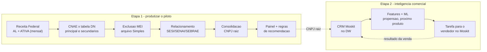
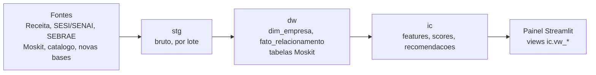

# Arquitetura de Dados — Inteligência Comercial Industrial (AL)

24/09/2026 · preparado por Wilton Costa

Material de apresentação para o time do Observatório, responsável por colocar o modelo em produção (Data Warehouse → Power BI / aplicação). Cobre a Etapa 1 (dados) do início ao fim e fecha com o que vem na Etapa 2.

Repositório (código-fonte de tudo abaixo): [github.com/wiltonds/AI-Commercial-Intelligence](https://github.com/wiltonds/AI-Commercial-Intelligence). Schema coluna a coluna da base atual: [Dicionário de Dados](dicionario_dados.md). Versão comentável/editável deste material: [doc no claude.ai](https://claude.ai/artifact/5nNAR3w952B3YAbkQboAve). Visão interativa (com números ao vivo): página "🏗️ Arquitetura & Fluxo" no próprio dashboard (`painel_arquitetura.py`).

## Pipeline de dados, ponta a ponta

As cinco primeiras caixas são a Etapa 1. As três seguintes são a Etapa 2 (roadmap, ver seção final). Hoje só a consolidação por CNPJ raiz (`src/tools/cnpj_raiz.py`) e o painel estão neste repositório e sob teste automatizado — o resto da Etapa 1 já existe como script, mas fora de controle de versão (ver "Estado atual").

## Etapa 1.1 — Coleta

Job mensal: baixa `Estabelecimentos*.zip` e `Simples.zip` da Receita Federal, lidos em streaming, e recorta para UF = AL e situação cadastral 02 (ATIVA). Roda hoje em `baixar_cnpj_al.py` e `gerar_dataset_cnpj_al_v4.py`, fora deste repositório (ver "Estado atual").

A base de relacionamento institucional (quem já é cliente SESI e/ou SENAI) e a base de referência SEBRAE entram depois, cruzadas por CNPJ:

| Fonte | Papel |
| --- | --- |
| `relacionamento_SESI&SENAI.xlsx` / `BASE_DADOS_SESI&SENAI_N_RELACIONAMENTO.xlsx` | Cadastro de relacionamento institucional — quem já é cliente SESI e/ou SENAI |
| `industrias_ativas_sebrae.xlsx` | Base de referência do SEBRAE, usada como segunda fonte de verificação |

## Etapa 1.2 — Curadoria: o que conta como indústria

Nem todo CNAE que a empresa declarou é indústria no sentido que o CNI/SESI/SENAI atende. A curadoria cruza CNAE principal **e secundários** contra uma tabela de referência de 1.298 CNAEs (tabela DN), em `gerar_dataset_cnpj_al_v4.py`. O resultado vira a coluna `EH_INDUSTRIA` na base mestre deste repositório.

Decisão já tomada: divisões de fronteira como correio, energia e construção continuam como indústria-alvo, mesmo não sendo indústria de transformação pura — são setores que o SESI/SENAI atende hoje na prática.

Regra de exclusão de MEI (Microempreendedor Individual) **já está implementada**, não é uma lacuna em aberto: toda raiz com `opcao_mei = S` (cruzada contra o arquivo Simples da Receita) sai do universo antes da base chegar a este repositório. É por isso que a `BASE_MESTRE_COMERCIAL.csv` não tem nenhum CNPJ optante do MEI.

## Etapa 1.3 — Limpeza: de estabelecimento para CNPJ raiz

A Receita Federal cadastra cada unidade física — matriz e cada filial — com um CNPJ próprio (14 dígitos), mas todas compartilham os 8 primeiros dígitos, o CNPJ raiz. Sem tratar isso, uma empresa com filiais era contada várias vezes.

A consolidação (`src/tools/cnpj_raiz.py`, neste repositório) reduz a base a uma linha por empresa:

- Representante do grupo: a matriz (CNPJ com ordem "0001") quando está na base; senão, o estabelecimento que já é cliente SESI/SENAI; senão, o primeiro por CNPJ.
- Relacionamento institucional herdado do grupo inteiro — se qualquer filial já é cliente, a empresa conta como cliente, mesmo que o cadastro esteja em outro CNPJ do mesmo grupo.

A lógica está coberta por testes automatizados que travam os números abaixo contra a base real.

## O funil completo, da Receita até o painel

Números da auditoria de extração V4 (competência 2026-07). As quatro primeiras linhas vêm de fora deste repositório; a última é calculada ao vivo sobre a base atual.

| Etapa | Estabelecimentos | Empresas (CNPJ raiz) | Origem |
| --- | --- | --- | --- |
| Ativos em Alagoas | 232.017 | 224.298 | Receita (auditoria V4) |
| Com atividade industrial (tabela DN) | 58.100 | 56.448 | Receita (auditoria V4) |
| … dos quais pelo CNAE principal | 36.874 | — | Receita (auditoria V4) |
| Base-mãe comercial + correções | 32.935 | — | `construir_base_mestre.py` |
| Após excluir optantes MEI (base atual) | 14.903 | 13.978 | Base Mestre (ao vivo, este repositório) |

Da linha "base-mãe + correções" (32.935) até a base atual (14.903), a diferença é a exclusão de MEI — não uma perda de dado.

## Regras aplicadas, em ordem

| # | Regra | O que faz | Onde está hoje |
| --- | --- | --- | --- |
| 1 | Download da competência | `Estabelecimentos*.zip` + `Simples.zip`, lidos em streaming | `BI_Project/baixar_cnpj_al.py` (fora deste repo) |
| 2 | Recorte AL + ATIVA | UF = AL e situação cadastral 02 | `BI_Project/gerar_dataset_cnpj_al_v4.py` (fora deste repo) |
| 3 | CNPJ padronizado | 14 dígitos; CNPJ raiz = 8 primeiros | `construir_base_mestre.py` (fora deste repo) |
| 4 | Cruzamento de CNAE | Principal e secundários × tabela DN (1.298 CNAEs) | `BI_Project/gerar_dataset_cnpj_al_v4.py` (fora deste repo) |
| 5 | Correções auditadas | CNPJs clientes conferidos na Receita | `data/raw/CORRECAO_UNIVERSO_CONFIRMADA.csv` (neste repo) |
| 6 | Exclusão MEI | Raiz com `opcao_mei = S` sai do universo | `construir_base_mestre.py` (fora deste repo) |
| 7 | Relacionamento | SESI, SENAI, SEBRAE; status e cross-sell | `construir_base_mestre.py` (fora deste repo) |
| 8 | Consolidação por raiz | Uma linha por empresa; relacionamento herdado do grupo | `src/tools/cnpj_raiz.py` (neste repo, testado) |

6 das 8 regras rodam hoje em `C:\Users\wilton.costa\Desktop\BI_Project`, uma pasta local **sem controle de versão**. É o maior risco de continuidade da Etapa 1 — não é falta de lógica, é falta de versionamento, agendamento e um schema de destino.

## Estado atual — o que já está no GitHub

- `data/processed/BASE_MESTRE_COMERCIAL.csv` — saída do funil acima: uma linha por estabelecimento, já sem MEI, com os sinalizadores de indústria, relacionamento e CNPJ raiz.
- Dashboard Streamlit (`app.py`) — 11 visões, incluindo esta própria página de arquitetura, com toggle para alternar entre visão por empresa (CNPJ raiz, padrão) e por estabelecimento.
- Página dedicada "Empresas (CNPJ raiz)" — segmenta comercialmente em três lentes mutuamente exclusivas: Novos/frios (12.915), Clientes/expansão (635), Multiestabelecimento (428).
- Pipeline de recomendação por IA (`src/pipeline.py` + agentes) — para um CNPJ específico, cruza afinidade setorial com o catálogo real de produtos SENAI (177 produtos/serviços) e sugere oportunidades, com um agente SDR generativo (Claude API) que traduz isso em abordagem comercial.

Importante para quem for produtizar: as regras 1–7 do funil rodam manualmente, fora deste repositório, sem agendamento. O dashboard só lê o CSV que sobra no final. Não existe gravação num Data Warehouse.

## Próximo passo — o que falta para produtizar

Não é construir do zero — é dar controle de versão, agendamento e destino a algo que já funciona manualmente:

1. **Versionar `BI_Project`** — trazer as 6 regras que rodam fora deste repositório para controle de versão (git), com revisão de código e histórico.
2. **Agendar a execução mensal** — hoje alguém dispara os scripts na mão a cada competência; precisa virar um job agendado, com registro do lote executado (ex.: uma tabela `ic.controle_lote`).
3. **Gravar direto no Data Warehouse** — em vez de sobrescrever um CSV local, o pipeline passa a escrever nas camadas do DW abaixo, e o Power BI ou a aplicação leem de lá.

Hoje o painel lê CSV local; em produção passa a ler as views `ic.vw_*` do SQL Server. A lógica em `src/` não muda.

## Roadmap — Etapa 2

Depois que a Etapa 1 estiver versionada, agendada e gravando no Data Warehouse, entra a Etapa 2: **CRM Moskit** (ligado pelo CNPJ raiz), features + Machine Learning (propensão, próximo produto) sobre a base consolidada, e a devolução da recomendação como tarefa para o vendedor no Moskit — fechando o ciclo com o resultado da venda alimentando o próximo modelo. Já existe um protótipo funcional de agente SDR generativo no projeto, hoje acionado manualmente a partir do dashboard.

Arquitetura detalhada da Etapa 2 fica para um próximo material, depois que a Etapa 1 estiver rodando sozinha.
