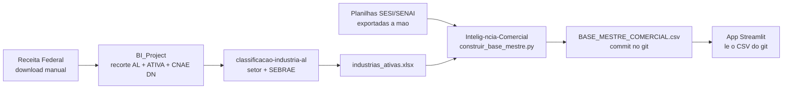
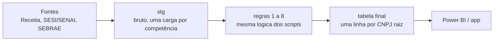

# Guia para o Observatório — automatizar e manter o painel de Inteligência Comercial

25/09/2026 · preparado por Wilton Costa

Complementa [arquitetura_dados.md](arquitetura_dados.md) (o funil e as regras) e [dicionario_dados.md](dicionario_dados.md) (o schema). Este guia é o passo a passo: o que o Observatório recebe, o que precisa construir e em que ordem.

## O objetivo, em uma frase

Ter um painel (Power BI ou app) com a mesma visão do protótipo [inteligenciacomerical.streamlit.app](https://inteligenciacomerical.streamlit.app/), que se atualiza sozinho a partir da Receita Federal, sem ninguém rodar script na mão.

### O que o painel precisa mostrar (escopo da primeira entrega)

1. Quantas indústrias ativas existem em Alagoas, pela régua CNI (CNAE principal na tabela DN), sem MEI.
2. A mesma contagem por empresa (CNPJ raiz), além da contagem por estabelecimento.
3. Quantas dessas indústrias são clientes SESI.
4. Quantas são clientes SENAI (e quantas são clientes dos dois).
5. Situação SEBRAE dentro do recorte indústria.

Recomendação por IA, CRM (Moskit) e modelo preditivo ficam para a Etapa 2 e **não** entram nesta entrega.

## Como funciona hoje (o protótipo)

Tudo roda na máquina do Wilton, disparado manualmente. O app não tem banco de dados: ele lê os CSVs versionados no git. Para "atualizar o painel" hoje, é preciso rodar os scripts na ordem, fazer commit do CSV novo e esperar o Streamlit Cloud recarregar.

**O trabalho do Observatório é substituir tudo o que está à esquerda da caixa G por um processo agendado que grava no Data Warehouse.**

## Passo 0 — Antes de qualquer coisa: tirar os dados dos repositórios públicos

`AI-Commercial-Intelligence` e `Intelig-ncia-Comercial` estão **públicos** no GitHub, e o primeiro contém as planilhas de relacionamento SESI/SENAI e a Base Mestre (`data/raw/*.xlsx`, `data/processed/*.csv`). Isso é a lista de clientes da instituição, aberta para qualquer pessoa.

- [ ] Tornar os dois repositórios privados, ou remover os arquivos de dados e o histórico deles (remover só no commit mais recente não basta, porque eles continuam no histórico do git).
- [ ] Definir onde os dados passam a morar: o DW, com controle de acesso.
- [ ] Observação: o app no Streamlit Community Cloud lê do repositório. Se o repositório virar privado, o app precisa ser reconfigurado com acesso ao repositório privado, ou passar a ler do DW (Passo 5).

## Passo 1 — Acessos que o Observatório precisa receber

### Código

| Repositório | Visibilidade | O que tem |
| --- | --- | --- |
| [BI_Project](https://github.com/wiltonds/BI_Project) | privado | Download da Receita, recorte AL + ATIVA, cruzamento com a tabela DN (regras 1, 2 e 4) |
| [classificacao-industria-al](https://github.com/wiltonds/classificacao-industria-al) | privado | Recupera o código CNAE, classifica setor IBGE, cruza com o SEBRAE |
| [Intelig-ncia-Comercial](https://github.com/wiltonds/Intelig-ncia-Comercial) | público | `construir_base_mestre.py`: exclusão de MEI, relacionamento SESI/SENAI (regras 3, 6 e 7) |
| [AI-Commercial-Intelligence](https://github.com/wiltonds/AI-Commercial-Intelligence) | público | Consolidação por CNPJ raiz (regra 8, com testes), o app Streamlit, o job diário de situação cadastral, esta documentação |

Hoje os 4 estão na conta pessoal do Wilton. Recomendação: transferir para uma organização institucional no GitHub, para o projeto não depender de uma conta pessoal.

### Bases de dados

| Base | Arquivo hoje | De onde vem | Atualização |
| --- | --- | --- | --- |
| Estabelecimentos + Simples (Receita) | `Estabelecimentos*.zip`, `Simples.zip` | Dados abertos da Receita Federal | Automática (mensal): é só baixar |
| Tabela DN (1.298 CNAEs industriais) | dentro de `BI_Project` | CNI | Rara, só quando a CNI revisar |
| Tabela oficial CNAE CNI | dentro de `classificacao-industria-al` | CNI | Rara |
| Relacionamento SESI/SENAI | `relacionamento_SESI&SENAI.xlsx`, `BASE_DADOS_SESI&SENAI_N_RELACIONAMENTO.xlsx`, `BASE_CONSOLIDADA_SESI_SENAI.xlsx` | **O Observatório já tem mapeado** | Substituir as planilhas pela base do Observatório (ver alinhamento abaixo) |
| Tabela de CNAEs SEBRAE (541 CNAEs) | [`classificacao-industria-al/referencia/cnaes_sebrae.csv`](https://github.com/wiltonds/classificacao-industria-al) | Revisão FIEA × SEBRAE | Rara, só quando a lista for revisada. Carregar no DW como tabela de referência |
| Correções auditadas | `CORRECAO_UNIVERSO_CONFIRMADA.csv` | Conferência manual na Receita | Sob demanda |

**Clientes SESI/SENAI:** o Observatório já tem essa base mapeada, então as planilhas manuais saem do processo. Antes da troca, alinhar três pontos para os números não mudarem só por causa da fonte nova:

- **Chave do cruzamento:** o protótipo cruza por CNPJ completo (14 dígitos) e depois herda o relacionamento para o grupo inteiro pelo CNPJ raiz. Se qualquer filial é cliente, a empresa conta como cliente.
- **O que conta como "cliente":** qualquer atendimento já registrado ou só nos últimos N meses? Existe status ativo ou inativo?
- **Conferência:** cruzar a base do Observatório com as planilhas atuais na mesma competência e explicar as diferenças antes de trocar a fonte.

**SEBRAE:** não depende de base externa. É um cruzamento automático entre a Receita e a tabela `cnaes_sebrae.csv`:

- **Elegível SEBRAE** = o CNAE **principal** do CNPJ está na tabela. CNAE secundário não conta (coluna `requisito` da tabela).
- **Situação comercial** das elegíveis, combinando com os clientes SESI/SENAI: `NÃO ATENDIDA`, `CLIENTE SESI / OPORTUNIDADE SENAI`, `CLIENTE SENAI / OPORTUNIDADE SESI` ou `SESI + SENAI`. As não elegíveis ficam como `FORA DO ESCOPO SEBRAE`.
- **Quem é cliente vem sempre da base de relacionamento SESI/SENAI**, a mesma que alimenta o resto do painel. A tabela SEBRAE só decide a elegibilidade.
- Referência na base final (14.903 estabelecimentos, sem MEI): 11.242 elegíveis, das quais 10.580 não atendidas, 367 só SESI, 160 só SENAI e 135 com os dois. Outras 3.652 estão fora do escopo SEBRAE e 9 não foram encontradas na base SEBRAE.
- A tabela tem 5 CNAEs da seção A (silvicultura: madeira, carvão vegetal, látex). Se o painel for "apenas indústria", decidir se eles entram.
- **Correções feitas em 25/09/2026:** até esta data, o protótipo mostrava todas as elegíveis como `NÃO ATENDIDA`. Eram dois problemas:
  1. `cruzar_sebrae.py` não reconhecia nenhum cliente, porque as colunas SESI/SENAI guardam o CNPJ do cliente e o script procurava "sim".
  2. `construir_base_mestre.py` copiava a situação pronta do arquivo SEBRAE, que usa uma cópia antiga do relacionamento. Depois da correção 1, isso fazia cerca de 150 empresas aparecerem como cliente numa visão e como "sem relacionamento" em outra. Agora a situação é calculada com o relacionamento da própria base.

  Os números acima já são os corrigidos.

### Segredos

- `ANTHROPIC_API_KEY`: só para a página de recomendação por IA, que fica fora desta entrega.
- ReceitaWS (usada no job diário): API pública, sem chave, limitada a ~3 consultas/minuto.

## Passo 2 — Reproduzir o resultado atual antes de mudar qualquer coisa

Antes de automatizar, o Observatório roda o pipeline manualmente, uma vez, e confere se chega nos mesmos números. Isso garante que o processo foi entendido.

Números de referência (competência 2026-07):

| Etapa | Estabelecimentos | Empresas (CNPJ raiz) |
| --- | --- | --- |
| Ativos em Alagoas | 232.017 | 224.298 |
| Com atividade industrial (tabela DN) | 58.100 | 56.448 |
| Base-mãe comercial + correções | 32.935 | — |
| Após excluir MEI (base final) | 14.903 | 13.978 |

Ferramentas de conferência que já existem:
- `BI_Project/auditar_dataset_industrial_al.py`: confere as três primeiras linhas.
- `tests/test_cnpj_raiz.py` (neste repositório): trava a consolidação por CNPJ raiz contra a base real.
- `construir_base_mestre.py` já foi testado reproduzindo a base atual byte a byte.

A ordem de execução e os comandos de cada script estão descritos no README de cada repositório. Onde o README não bastar, o Wilton acompanha essa primeira rodada.

## Passo 3 — Levar o processamento para o DW, camada por camada

- **stg:** o arquivo da Receita e as bases de clientes, gravados sem transformação, marcados com a competência.
- **Regras:** a mesma lógica dos scripts, em Python agendado ou em SQL, a critério do Observatório. O que não pode mudar é o **resultado**: os números do Passo 2 são o teste de aceite.
- **Tabela final:** uma linha por CNPJ raiz e uma foto por competência (sem sobrescrever), para o painel mostrar a evolução mês a mês.
- **Limpeza de schema:** [dicionario_dados.md](dicionario_dados.md) aponta 6 grupos de colunas redundantes, encoding corrompido e um campo não confiável (`CNAE_DIVISAO`). A tabela final não deve copiar esses problemas.

## Passo 4 — Agendar e vigiar

| Job | Frequência | O que faz | Estado hoje |
| --- | --- | --- | --- |
| Carga da Receita + regras | Mensal, quando a Receita publica a competência nova | Recalcula o universo inteiro | Script pronto, sem agendamento |
| Carga de clientes SESI/SENAI | A definir, na frequência em que a base do Observatório já atualiza | Atualiza quem é cliente | Base já existe no Observatório; falta ligar ao pipeline |
| Situação cadastral | Diária | Checa uma fatia rotativa de CNPJs na ReceitaWS e marca baixa ou inaptidão sem esperar o mês fechar | Pronto (`jobs/checar_situacao_cadastral.py`), sem agendamento |

Checagens que devem **bloquear a publicação** se falharem:
- A contagem final ficar fora de uma faixa esperada em relação ao mês anterior (ex.: variação acima de 10%).
- Aparecer algum CNPJ optante do MEI.
- Aparecer CNPJ duplicado na tabela final.
- A cobertura do CNAE principal ficar abaixo de 97%.

Registrar cada execução (competência, data, contagens, sucesso ou falha) numa tabela de controle, por exemplo `ic.controle_lote`.

### Exclusão de MEI: precisa entrar na carga mensal

Regra: toda empresa (CNPJ raiz) com `opcao_mei = S` no arquivo Simples da Receita fica fora do painel. Na base atual, nenhum optante do MEI aparece.

Como funciona hoje:

1. `BI_Project/gerar_situacao_mei.py` baixa o `Simples.zip` da Receita (arquivo nacional, sem cabeçalho, 7 colunas), filtra para as raízes do universo industrial de AL e grava `dataset_<competência>_v4/AUDITORIA/SITUACAO_MEI_SIMPLES.csv`.
   - Pré-requisito: `gerar_dataset_cnpj_al_v4.py` já rodado, porque ele usa o arquivo de empresas do universo.
2. **Passo manual:** esse CSV é copiado para `projeto_comercial/saida/SITUACAO_MEI_SIMPLES.csv`.
3. `construir_base_mestre.py` lê o arquivo e remove as raízes MEI.

O que o Observatório precisa garantir na automação:

- **Gerar de novo todo mês, na mesma competência da Receita.** Empresas entram e saem do MEI. Usar o arquivo de um mês com a Receita de outro mês gera erro silencioso no universo.
- **A competência e a URL da Receita estão fixas no código** (`COMPETENCIA = "2026-07"` e o link de compartilhamento do mês). Precisam virar parâmetro do job.
- **Tirar a cópia manual do passo 2:** o job grava o arquivo onde o passo seguinte lê, ou os dois leem da mesma tabela no DW.
- **Falhar se o arquivo não existir.** Até 25/09/2026, o `construir_base_mestre.py` só imprimia um aviso e seguia **com os MEI dentro**. Agora ele para com erro. A checagem "aparecer algum CNPJ optante do MEI", listada acima, continua valendo como segunda barreira.
- **O script foi reconstruído:** o original que gerou o arquivo em uso (14/09/2026) se perdeu, e `gerar_situacao_mei.py` recria a mesma lógica a partir do layout do arquivo. Em 25/09/2026 ele foi rodado contra o `Simples.zip` de julho de 2026 e comparado com o arquivo em uso:
  - **Mesmo layout** (7 colunas, mesmo formato).
  - **195 empresas da base final mudariam para MEI** e 224 raízes hoje excluídas voltariam. A diferença vem da **versão do arquivo da Receita**, não da lógica: o arquivo em uso tem saídas do MEI com data de até 12/09/2026, então saiu de uma publicação de setembro, e o teste usou a de julho. Para confirmar a equivalência de ponta a ponta, rodar o script de novo com a publicação mais recente e comparar.
  - **Não substituir o arquivo em uso pelo de julho:** ele é mais antigo.
  - Isso também mostra o tamanho da variação: em dois meses, cerca de 400 raízes mudaram de situação no MEI. É por isso que o arquivo precisa ser gerado de novo em toda carga.
  - Raízes do universo que não aparecem no `Simples.zip` (4.328 no teste) são tratadas como não MEI.

## Passo 5 — O painel

Duas opções. A decisão é do Observatório junto com o time comercial:

| | Power BI | Manter o app Streamlit |
| --- | --- | --- |
| Esforço | Reconstruir as telas | Só trocar a fonte: o app passa a ler do DW em vez do CSV |
| Acesso | Controle de acesso institucional nativo | Precisa de autenticação e de hospedagem institucional (hoje está no Streamlit Community Cloud, conta pessoal) |
| Quando faz sentido | Se o comercial já usa Power BI | Se a prioridade é entregar rápido e manter as telas que já existem |

Nos dois casos, o protótipo serve de referência de telas. As páginas relevantes para esta entrega são: Visão Geral, Empresas (CNPJ raiz), Mercado, Visão SESI, Visão SENAI, Visão SEBRAE, Visão Integrada e Matriz Cross-sell.

## Decisões tomadas (25/09/2026)

Valem para a primeira entrega. Se mudarem, o guia é atualizado.

1. **MEI:** o painel exclui só os optantes do MEI, que é a regra atual (`opcao_mei = S` no arquivo Simples da Receita). Resultado de referência: 13.978 empresas (CNPJ raiz) e 14.903 estabelecimentos.
2. **Construção (seção F) e energia (seção D) contam como indústria.**
3. **Os 5 CNAEs de silvicultura continuam na tabela SEBRAE.** Hoje nenhuma empresa da base tem esses CNAEs, então isso não muda nenhum número.

## Decisões em aberto

1. **Serviços que a tabela DN da CNI conta como indústria entram no painel?** A base final tem 3.155 empresas (CNPJ raiz) com CNAE principal fora das seções de indústria do IBGE (B a F). Os maiores grupos:
   - serviços de engenharia (7112-0/00): 1.078 estabelecimentos;
   - manutenção e reparação de veículos e motos (4520-0/xx, 4543-9/00): cerca de 1.150;
   - telecomunicações e provedores de internet (61xx): cerca de 720;
   - fornecimento de refeições para empresas (5620-1/01): 218;
   - correio (5310-5/01): 122.

   Hoje eles entram, porque a régua é a tabela DN. Se o painel for "só indústria pela seção IBGE", o universo cai de 13.978 para 10.820 empresas (de 14.903 para 11.502 estabelecimentos). Desses 3.155, 104 são clientes SESI e/ou SENAI.
2. **A definição de cliente SESI/SENAI da base do Observatório é a mesma do protótipo?** (ver Passo 1)
3. **Quem é o dono do processo depois da entrega:** quem valida cada competência nova e quem responde quando um número muda?
